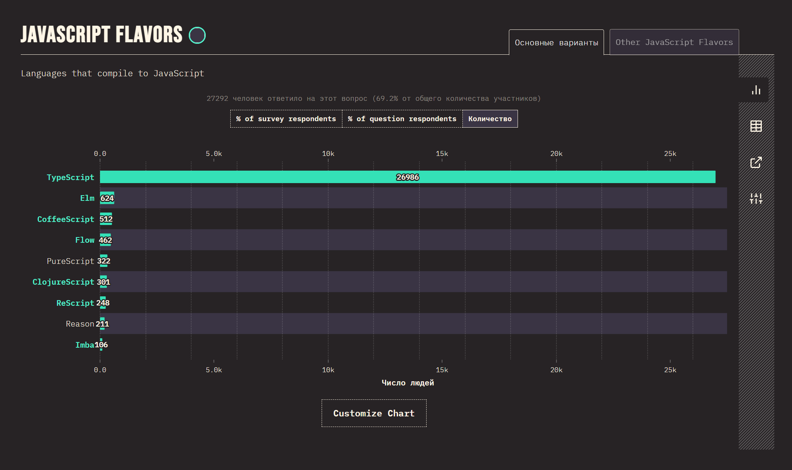
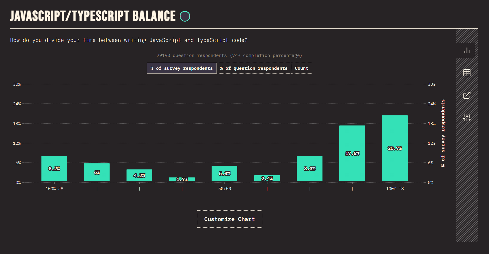

[🔙](/README.md)

# Lesson #1. Intro

## О TypeScript
<u>**Typescript**</u> - строго типизированный open source ЯП, который разрабатывается Microsoft и призван исправить недостатки ванильного JavaScript. Он был изначально изобретён [Андерсом Хейлсбергом](https://ru.wikipedia.org/wiki/%D0%A5%D0%B5%D0%B9%D0%BB%D1%81%D0%B1%D0%B5%D1%80%D0%B3,_%D0%90%D0%BD%D0%B4%D0%B5%D1%80%D1%81), который в свою очередь является разаработчиком C#, поэтому TypeScript и C# очень похожи друг на друга.

По сути TypeScript является надмножеством JavaScript. Исключением являются те моменты, когда в JS появляются совсем свежие фичи, которые лишь через некоторое время переносятся и в TS.

## Популярность TypeScript
Согласно исследованиям популярного опросного портала [StateOfJS](stateofjs.com), TypeScript просто не имеет каких-либо аналогов, если рассматривать его, как надмножество для JS.  

Также, не секрет, что большинство разработчиков предпочитают TypeScript, а не JavaScript, если речеь идёт о крупных проектах.

####Проблемы JS, которые помогает решить TS:

- отсутствие TypeSafety (частично можно решить расширениями)
- отсутствие строгой типизации
- отсутствие нормального autocomplete (например: обращение к свойствам объектов происходит вслепую)
- невозможность рефакторинга вне рантайма
- невозможность понять структуры данных

_`@ts-check` - технология js, которая активизирует <u>некоторые</u> проверки typescript для js-файлов._

## Где применяется TS

- Angular
- React
- NodeJS
- Next.js
- Vue
- Svelta
- Nest.js
- React Native
- Native Script
- Remix
- Cypress
- А также в большинстве NPM пакетов

## Настройка / установка / использование

Глобальная установка Typescript при помощи nodeJS и npm:

```
npm i -g typescript
```

<u>**TSC**</u> (TypeScript Compiler) - компилятор, который позволяет скомпилировать TypeScript код в JavaScript код, для дальнейшего исполнения.

Несколько стандартных команд TSC:

- `tsc --help` - отображает список стандартных команд TSC
- `tsc --init` - инициализирует TS и создаёт стандартный конфиг
- `tsc` - выполняет компиляцию всех ts-файлов в директории в js

**ВАЖНО!** Если вы хотите запускать TypeScript код через CodeRunner или через Node.js вам понадобится `ts-node`. Установить его можно следующим образом:
```bash
npm install -g ts-node
```

## Примеры использования
💻 javascript:

```javascript
let a = 5
let b = -5

console.log(a + b)

function addMoney(sum, money) {
	return money + sum
}

addMoney(0, 10)
```

💻 typescript:

```typescript
let a: number = 5
let b: number = -5

console.log(a + b)

function addMoney(sum: number, money: number): number {
	return money + sum
}

addMoney(0, 10)
```
