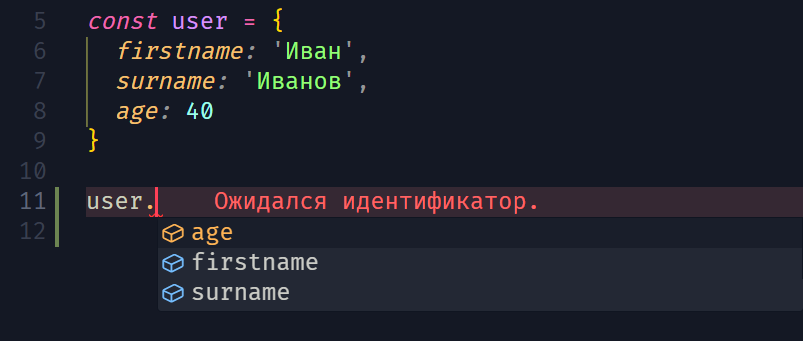

[🔙](/README.md)

## Lesson #4. Objects in TypeScript

### Типизация объектов

Объекты в TypeScript, впрочем как и в JavaScript, являются одним из основных типов данных, поэтому важно уметь их правильно типизировать.

К плюсам работы с объектами в TypeScript по сравнению с JavaScript также можно отнести то, что TypeScript знает о всех свойствах, которые находятся в объекте и подсказывает нам об этом во время написания кода:


Рассмотрим несколько примеров типизации объектов:

**пример #1.**
<u>типизация объекта, только c указанием типа данных, которые вернет функция:</u>

```typescript
function getFullName(userInfo): string {
	return `${userInfo.firstname} ${userInfo.surname}`
}

const user = {
	firstname: 'Иван',
	surname: 'Иванов',
	age: 40
}
```

Данный пример не совсем корректен, т.к. в качестве параметра функция неявно получает тип данных `any`, и даже, если она всё-таки получит объект, то не факт, что в нём будут свойства `firstname` и `surname`

**пример #2.**
<u>типизация объекта, с указанием типов для всех необходимых в функции свойств данного объекта.</u>

```typescript
function getFullName(userInfo: { firstname: string; surname: string }): string {
	return `${userInfo.firstname} ${userInfo.surname}`
}

const user = {
	firstname: 'Иван',
	surname: 'Иванов',
	age: 40
}
```

В данном случае, указаны всё необходимое для корректной работы функции `getFullName()` с данным объектом. Если какое-то из необходимых свойств будет отсутствовать, TypeScript сообщит нам об этом ещё до запуска кода, так мы сможем легко отловить и исправить возникшую ошибку.

_Примечание: Если сравнивать TypeScript например c похожим на него C#, то в C#, при передаче более широкого объекта, это будет считаться ошибкой, в TypeScript же, достаточно того, чтобы в объекте присутствовали необходимые параметры._
