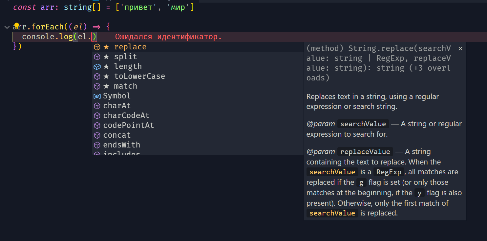

[🔙](/README.md)

## Lesson #5. Arrays in TypeScript

### Типизация массивов

Для того, чтобы задать определённый тип массиву используется следующая запись `arr: type[]`.

В JavaScript мы можем передать в массив что угодно, в TypeScript всё строже, однако, хотя делать неоднородные массивы зачастую не нужно, такая возможность в TypeScript всё равно есть.

Для создания неоднородных массивов в TypeScript мы можем сделать следующее:

- воспользоваться `any[]` (не рекомендуется)
- воспользоваться кортежем / Tuples (лекция 6)

### Autocomplete только для определенного типа данных

Также большим плюсом TypeScript является то, что autocomplete будет отображать только те методы, которые можно применить к типу данных, с которым вы работаете

Например, в данном массиве строк, к каждой строке мы можем применить только методы строк:


####Работа с входящими типами данных
Мы можем задать тип данных явно, прямо в моменте использования какого-либо метода массива, особенно полезно это бывает, когда данные мы получаем извне, например через API запрос или ввод пользователя.

пример, явной передачи типа данных во время применения `.filter()`

```typescript
const result = arr.filter((el: string) => el.length <= 5)
```

Этот код говорит TypeScript, что `el` должен быть строкой. Если в массиве `arr` есть элементы, которые не являются строками, TypeScript выдаст ошибку на этапе компиляции, что поможет предотвратить возможные ошибки во время выполнения программы.

Если Вы не используете явное преобразование типов, TypeScript может подсказать ошибку на этапе компиляции, если обнаружит несоответствие типов. Однако, в некоторых случаях, TypeScript не всегда может отловить нужную ошибку, и в этом случае использование явного преобразования типов предоставляет дополнительные гарантии.
