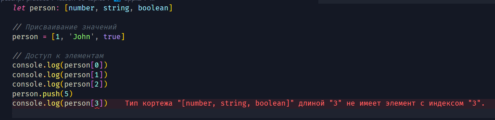

[🔙](/README.md)

## Lesson #6. Tuples

### Применение кортежей в TypeScript

В TypeScript, **tuple** или **кортеж** представляет собой особый тип данных, который позволяет определить массив, где каждый элемент может иметь свой собственный тип данных. Это отличается от обычного массива, где все элементы имеют одинаковый тип.

Хорошим примером tuple может послужить хук `useState()` в **React**. Который по сути предоставляет массив, в котором первым элементом всегда идёт значение, а вторым - функция.

**Синтаксис** для определения кортежа выглядит следующим образом:

```typescript
let myTuple: [number, string, boolean]
```

В данном примере `myTuple` - это tuple, состоящий из трех элементов, где первый элемент должен быть _числом_, второй - _строкой_, а третий - _логическим значением_.

пример использования tuple:

```typescript
let person: [number, string, boolean]

// Присваивание значений
person = [1, 'John', true]

// Доступ к элементам
console.log(person[0]) // Вывод: 1
console.log(person[1]) // Вывод: John
console.log(person[2]) // Вывод: true
```

Важно отметить, что порядок типов в tuple важен, и количество элементов должно соответствовать объявленному количеству типов.

Применение tuple может быть полезным, когда вы хотите, чтобы массив содержал элементы различных типов и при этом сохранялся порядок этих типов. Однако, следует использовать tuple осторожно, поскольку они могут усложнить код и делать его менее читаемым, особенно если количество элементов в tuple велико.

### Деструктуризация tuple

Как и при работе с обычными массивами, мы можем выполнить деструктуризацию для кортежа и получить из него необходимые данные.

```typescript
const user: [number, string, string] = [1, 'Иван', 'Иванов']
const [id, firstname, surname] = user

console.log(id) // 1
console.log(firstname) // Иван
console.log(surname) // Иванов
```

### Работа с tuple при неизвестном количестве элементов

> :warning: **Это не совсем верный кейс использования кортежей**: Будьте аккуратны!

Если перед нами стоит задача, согласно которой у нас в нашем tuple могут быть значения, количество которых неопределено, то можно воспользоваться `spread` оператором:

```typescript
const arr: [number, string, ...boolean[]] = [1, 'ff', true, false, true, true]
```

В данном примере:

- Первый элемент должен быть типа number.
- Второй элемент должен быть типа string.
- Последующие элементы (от третьего и далее) должны быть типа `boolean`. Синтаксис `...boolean[]` указывает, что остальные элементы массива могут быть типа `boolean`, и их может быть сколько угодно.

_Примечание: Работая с tuple, после рантайма мы можем что-то занести в него, что-то удалить и так далее, но обратиться к элементу, которого там изначально не было TypeScript нам не даст._

