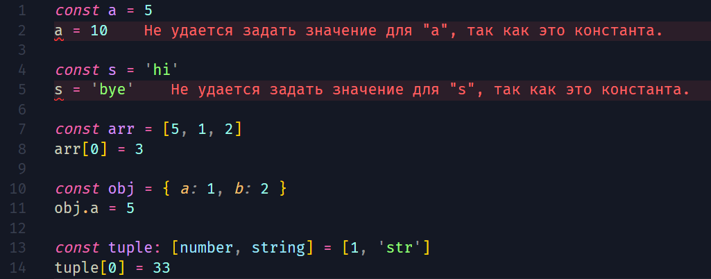

[🔙](/README.md)

## Lesson #7. Readonly

### Проблема использования const со ссылочным типом

"Проблема" кортежей и массивов заключается в том, что даже при наличии ключевого слова `const`, которое по идее задаёт постоянное, неизменямое значение, мы можем с лёгкостью менять значения в таких ссылочных типах данных.


Исходя из этого примера видно, что для примитивных типов значений `const` работает как и предпологалось, но в случае с ссылочными - это не помогает.

### Использование readonly

**readonly** в TypeScript - это ключевое слово, которое используется для указания, что соответствующий элемент (переменная, свойство, параметр и т. д.) доступен только для чтения, и его значение нельзя изменить после его инициализации. Это добавляет дополнительный уровень безопасности в ваш код, предотвращая неожиданные изменения данных.
Хоть модификатор `readonly` и доступен только для литералов массивов и кортежей, мы можем его использовать для определённых свойств объектов.

примеры использования:

```typescript
// #1 массивы
const readOnlyArray: readonly number[] = [1, 2, 3]
readOnlyArray[0] = 4 // Ошибка: Нельзя присвоить новое значение элементу массива

// #2 объекты
const readOnlyObject: { readonly key: string; readonly value: number } = {
	key: 'example',
	value: 42
}
readOnlyObject.key = 'newKey' // Ошибка: Нельзя изменить свойство объекта
readOnlyObject.value = 100 // Ошибка: Нельзя изменить свойство объекта

// #3 кортежи
const readOnlyTuple: readonly [string, number] = ['hello', 42]
readOnlyTuple[0] = 'world' // Ошибка: Нельзя присвоить новое значение элементу кортежа
```
