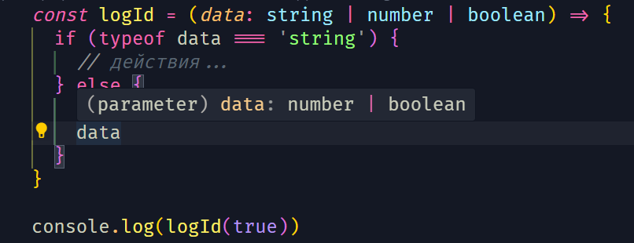

[🔙](/README.md)

## Lesson #9. Union

### Использование union

Union - указывает, что в той или иной переменной могут находиться различные типы при различных обстоятельствах. Union тип может быть полезен во многих случаях, например в функции, которая получает какие-то данные, но мы не знаем, какой у этих данных будет тип.

пример:

```typescript
const logId = (data: string | number | boolean) => {
	console.log(data)
}
```

### Сужение типов

Сужение типов (Narrowing) - позволяет, сделав рантайм проверку, применить ограничения на наш тип в рамках TypeScript.

пример:

На данном примере мы видим, что проверив первый кейс `if (typeof data === 'number')` у нас произошло сужение union типа и typescript теперь понимает, что `data` может быть либо `number` либо `boolean`.
