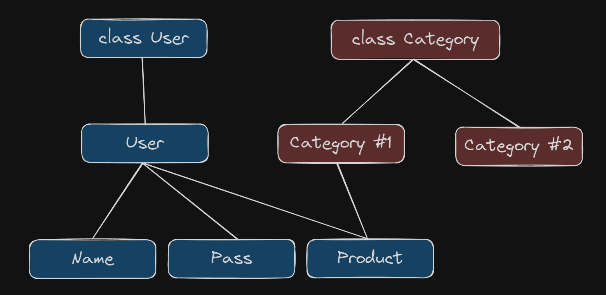

[🔙](/README.md)

## Lesson #20. Classes intro

### Введение про классы в TS

Хотя JS и является мультипарадигменным языком, большинство современных фреймворков (Angular, Nest и т.д.) используют ООП подход. В C#, Java, Python также используется ООП подход.

TS даёт очень неплохую возможность работать именно в ООП. А классы - это основа ООП.

Объектно-ориентированное программирование (ООП) — это подход к написанию программного кода, который основывается на концепции объектов. В основе ООП лежат четыре основных принципа: инкапсуляция, наследование, полиморфизм и абстракция.

### Принципы ООП

1.  **Абстракция**. Абстракция позволяет скрыть части реализации, или наоборот не дополнять наш объект. Допустим у нашего объекта `user` есть много свойств, но для того, чтобы залогиниться нам необходим только логин и пароль.
2.  **Инкапсуляция**. Инкапсуляция означает упаковку данных и методов, работающих с этими данными, в единый компонент, который мы называем объектом. Таким образом, детали реализации скрыты от внешнего мира, и мы можем взаимодействовать с объектом только через предоставленные интерфейсы.
3.  **Наследование**. Наследование позволяет создавать новые классы на основе существующих, повторно использовать их свойства и методы, а также расширять или изменять их. Класс, от которого происходит наследование, называется родительским (или базовым), а новый класс — дочерним (или производным). Например при добавлении нового объекта в БД он может получить новые свойства (id, date).
4.  **Полиморфизм**. Полиморфизм позволяет использовать объекты разных классов с общим интерфейсом. Он может проявляться как перегрузка методов (один метод с разными параметрами) или как переопределение методов в подклассах.
