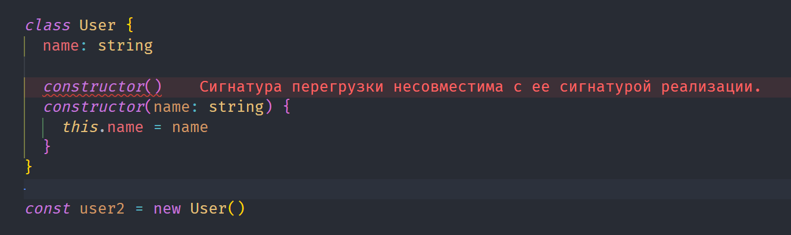

[🔙](/README.md)

## Lesson #21. Constructor

### Использование конструктора

**Конструктор** - это функция, внутри класса, которая автоматически вызывается при использовании ключевого слова `new`. Конструктор, всегда должен возвращать инстанс класса.

пример:

```typescript
class User {
	name: string

	constructor(name: string) {
		this.name = name
	}
}

const user = new User('Иван')
```

### Overload (перегрузка)

**Сигнатура** — это спецификация того, как выглядит часть кода (например, метод или свойство) в контексте определения типов. Она описывает типы данных, которые ожидаются для параметров функции, возвращаемого значения функции или свойств объекта. Таким образом, сигнатура предоставляет "шаблон" для типов данных, который следует использовать в определенном месте кода.

пример сигнатуры:

```typescript
// Сигнатура функции
type AddFunction = (a: number, b: number) => number

// Реализация функции с использованием сигнатуры
const add: AddFunction = (a, b) => {
	return a + b
}

// Пример использования функции
const result = add(3, 5)
console.log(result) // Выведет: 8
```

**Overload (перегрузка)** - это технология, которая позволяет, имея какую-то описанную сигнатуру функции, дополнить её альтернативной сигнатурой.

Перегрузка конструкторов в TypeScript предоставляет удобный способ определения различных вариантов использования конструктора, что может быть полезным для обработки различных сценариев и обеспечения более удобного интерфейса при работе с классами.

Преимущества использования перегрузок:

- Чистый код (если использовать с умом)
- Безопасность типов
- Своеобразный интерфейс пользователя



> **❌ Error**
> Сигнатура перегрузки, несовместима с сигнатурой реализации!

В TypeScript последним в списке конструкторов является конструктор реалзиации (имплементации), а все верхние - это конструкторы вызова. В контексте примера выше, имеется в виду, что всё, что передано в конструктор реализации должно быть совместимо со всеми конструкторами вызова.

пример перегрузки конструктора:

```typescript
// хотим создать пользователя либо только с именем, либо только с возрастом, либо и с имененем и с возрастом

class User {
	name: string
	age: number

	// Перегрузка конструкторов
	constructor()
	constructor(name: string)
	constructor(age: number)
	constructor(ageOrName?: string | number) {
		if (typeof ageOrName === 'string') {
			this.name = ageOrName
		} else if (typeof ageOrName === 'number') {
			this.age = ageOrName
		}
	}
}

const user1 = new User('Иван')
const user2 = new User()
const user3 = new User(33)
```
